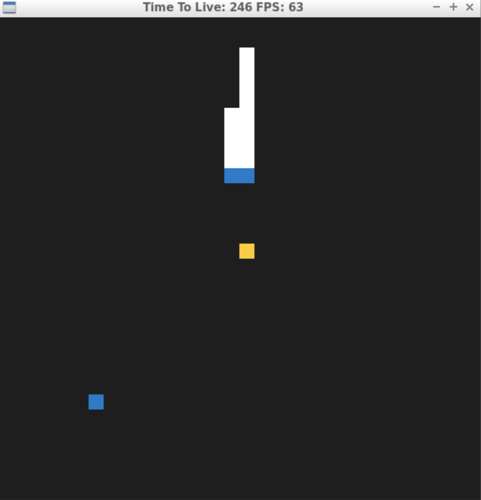

# CPPND: Capstone Snake Game Example

This is a starter repo for the Capstone project in the [Udacity C++ Nanodegree Program](https://www.udacity.com/course/c-plus-plus-nanodegree--nd213). The code for this repo was inspired by [this](https://codereview.stackexchange.com/questions/212296/snake-game-in-c-with-sdl) excellent StackOverflow post and set of responses.

The Capstone Project gives you a chance to integrate what you've learned throughout this program. This project will become an important part of your portfolio to share with current and future colleagues and employers.

In this project, you can build your own C++ application or extend this Snake game, following the principles you have learned throughout this Nanodegree Program. This project will demonstrate that you can independently create applications using a wide range of C++ features.

## Dependencies for Running Locally
* cmake >= 3.7
  * All OSes: [click here for installation instructions](https://cmake.org/install/)
* make >= 4.1 (Linux, Mac), 3.81 (Windows)
  * Linux: make is installed by default on most Linux distros
  * Mac: [install Xcode command line tools to get make](https://developer.apple.com/xcode/features/)
  * Windows: [Click here for installation instructions](http://gnuwin32.sourceforge.net/packages/make.htm)
* SDL2 >= 2.0
  * All installation instructions can be found [here](https://wiki.libsdl.org/Installation)
  >Note that for Linux, an `apt` or `apt-get` installation is preferred to building from source. 
* gcc/g++ >= 5.4
  * Linux: gcc / g++ is installed by default on most Linux distros
  * Mac: same deal as make - [install Xcode command line tools](https://developer.apple.com/xcode/features/)
  * Windows: recommend using [MinGW](http://www.mingw.org/)

## Basic Build Instructions

1. Clone this repo.
2. Make a build directory in the top level directory: `mkdir build && cd build`
3. Compile: `cmake .. && make`
4. Run it: `./SnakeGame`.

## CC Attribution-ShareAlike 4.0 International

Shield: [![CC BY-SA 4.0][cc-by-sa-shield]][cc-by-sa]

This work is licensed under a
[Creative Commons Attribution-ShareAlike 4.0 International License][cc-by-sa].

[![CC BY-SA 4.0][cc-by-sa-image]][cc-by-sa]

[cc-by-sa]: http://creativecommons.org/licenses/by-sa/4.0/
[cc-by-sa-image]: https://licensebuttons.net/l/by-sa/4.0/88x31.png
[cc-by-sa-shield]: https://img.shields.io/badge/License-CC%20BY--SA%204.0-lightgrey.svg

feature changes
-snake doesn't die when hitting obstacle or itself, instead dies after certain time elapsed without food
-snake speed doesn't increase with consumed food, but is a randomly assigned genetic property
-2 opponent snakes added which compete for food using A*
-grid height and width changed to constants, therefore can safely be made public and accessed by a* method
-game randomly spawns two types of food (Kendall Jenner and sumo wrestler) which prolong snake's life depending on its weight.

Rubric Loops, Functions, I/O:
-functions and control structures (game.h line 38 addition of A* method)
-project uses data structures and immutable variables (game.h line 20 usage of vector, snake.h line 23, 24 usage of const variable)

Rubric Object Oriented Programming:
-one or more classes are added to the project and all members explicitly specified as public, protected or private (food.h, kendall_jenner.h, sumo_wrestler.h introduce new classes, location variable is hidden and accessed via getter method)
-all class members that are set to argument values are initialized through member initialization list (game.cpp line 7-10, snake.h line 12)
-all class member functions document their effects, either through function names, comments or formal documentation (game.h line 34, descriptive function name and comment for method AStar())
-classes follow appropriate inheritance hierarchy with virtual and override functions (kendal_jenner.h, sumo_wrestler.h class KendallJenner and SumoWrestler are inherited from abstract class Food and override the pure virtual method GetWeight())

Rubric Memory Management:
-two functions use pass-by-reference (game.h line 15 method Run(), snake.h line 33 method UpdateBody())
-project uses RAII (game.h line 20 snake heap objects are managed by smart pointers. Being members of the stack variable "game", the smart pointer's destructors are called, thus the heap memory is freed automatically)
-project uses smart pointers instead of raw pointers (game.h line 20, 23 usage of unique pointer for storing snakes and food)

Rubric Concurrency:
-project uses multithreading (game.cpp line 79, 81, usage of async tasks for updating snakes)
-promise and future are used (game.cpp line 78, promise sets a boolean value indicating whether snake is alive which is received by future in caller thread)
